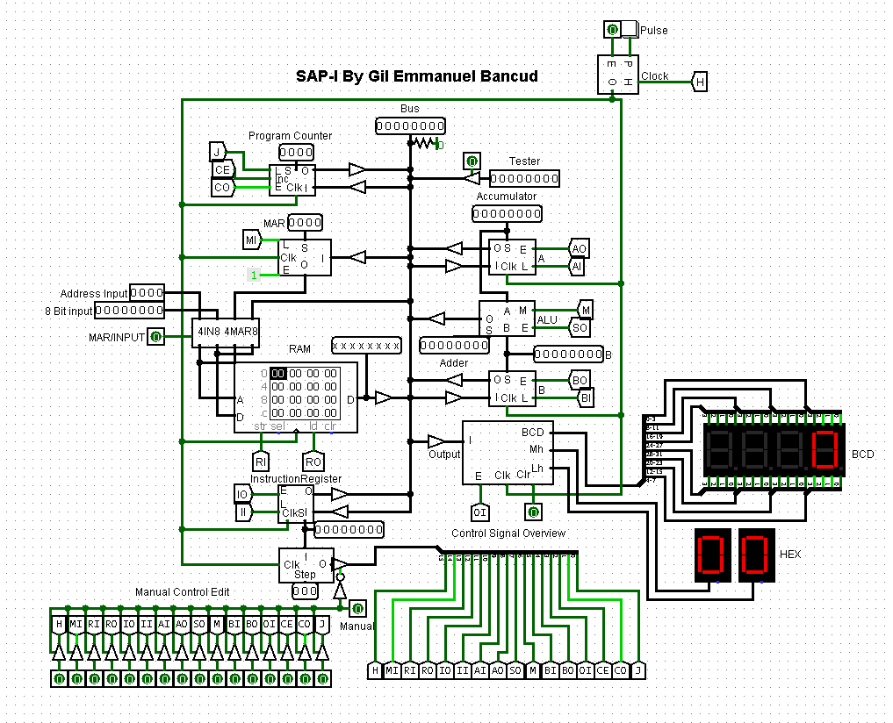

# SAP1
A logism Implementation of the SAP-I design

## Reference materials
These materials were instrumental in the creation of the project. It is my recommendation that you consider these as motivation and basis when creating your own implementation.
* [Digital Computer Electronics by Malvino](https://www.amazon.com/Digital-computer-electronics-Albert-Malvino/dp/0070398615)
* [Ben Eater's 8-bit Breadboard Computer Tutorial Series](https://eater.net/8bit/)
* [Robert Meade's SAP-I Logism Implementation](https://github.com/MeadeRobert/sap1)

## My SAP-I design

